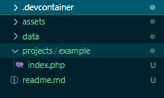

reference: [laravel devcontainer](https://github.com/theomessin/laravel-devcontainer)
## Requrements
- vscode
- remote vscode extensions
- nginx  conf knowledge
- basic linux knowledge
- knowledge wit docker and docker compose

## How to use
- clone this repo
- use vscode (local or remote ssh)
- this is what will it look like ouside devcontainer (.devcontainer was hidden)
 
- click remote options (bottom left)
 
- Reopen in container
 
- this is what it will looks like
 
- you will land with current directory with example project, you can add folder to add project
 
- if you add project edit configuration (cant be accessed inside devcontainer so local or ssh remote)

  - example i add laravel project
   
  - configuration resides at .devcontainer folder
  - add configuration for nginx at ./devcontainer/sites
   
    - set port (listen) on and path (root) for project
   
  - add port map on nginx service on docker-compose.yml
   
  - restart nginx container to take effect
   